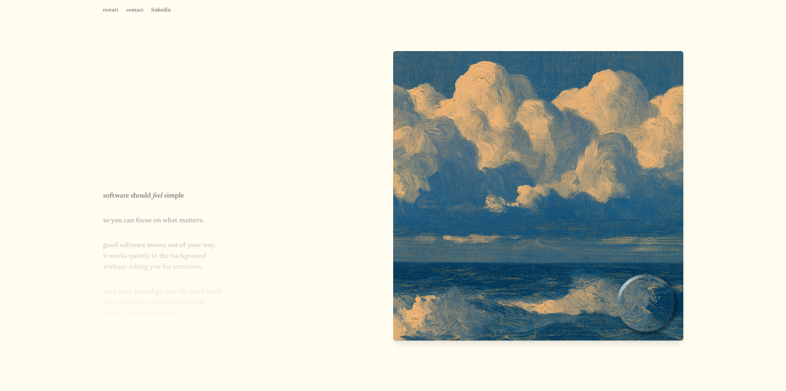

# Revised

Revised is my digital business card, designed around simplicity and minimalism.
It presents ten lines of text alongside eye-catching images, with a contact
email and a LinkedIn link where you can find more details about my work.

The live website is available at [revised.pl](https://revised.pl/).



## Technical overview

This is a statically generated, single-page Astro site styled with Tailwind CSS.
The implementation keeps the initial page simple and progressively adds the
interactive parts:

- Paintings are served as responsive WebP images generated by Astro's image
  pipeline, with explicit dimensions and suitable sources for each viewport.
- Once ready, an `OffscreenCanvas` layer takes over the interactive rendering.
  WebGL runs inside dedicated web workers so the lens effect does not block the
  main thread.
- Custom vertex and fragment shaders produce the lens magnification,
  refraction, bezel, lighting, and press effects.
- Scrolling synchronizes the ten lines of text with the image sequence. The
  active line is stored in the URL hash, making each point directly linkable and
  preserving the current position.
- A CSS gradient mask fades the surrounding text into the background, making
  each active line appear as though it is emerging from and disappearing into
  mist.
- The [Flexoki color palette](https://stephango.com/flexoki) provides warm,
  ink-and-paper tones that give the interface a more natural feel.

Requires Node.js 24.18 or newer and pnpm.

```sh
pnpm install
pnpm preview
```
